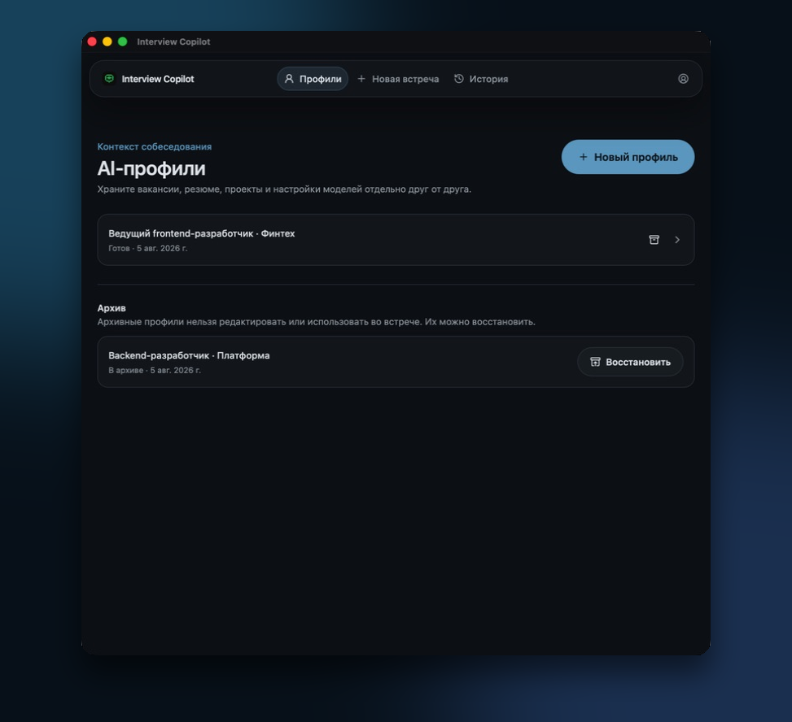
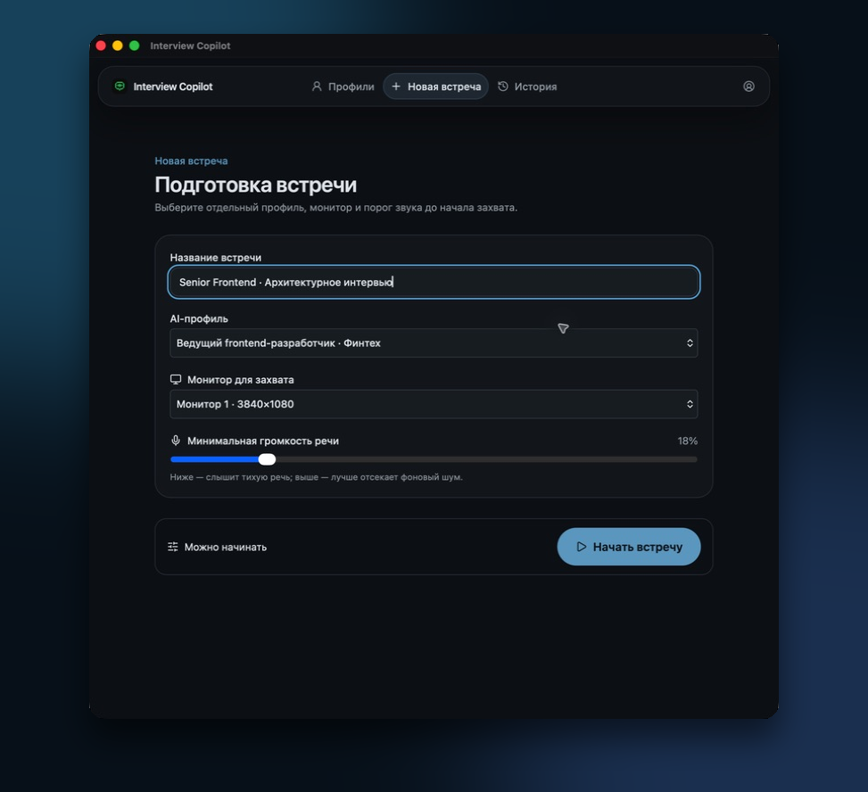
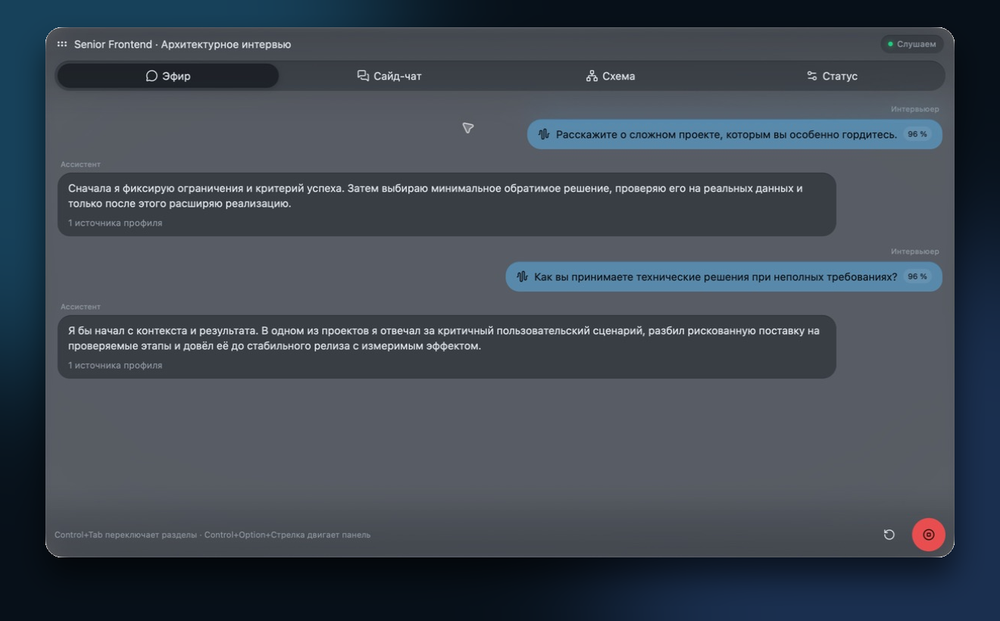

# Interview Copilot

Демонстрационное macOS-приложение на Vue 3 и Tauri 2. Авторизация, каталог моделей, распознавание и ответы работают через локальные mock-сценарии; внешнего AI-бэкенда и отправки писем нет.

## Интерфейс

### Главное окно



### Подготовка встречи



### Оверлей во время встречи



## Требования

- macOS 15+;
- Node.js 22.12+ и Corepack;
- стабильный Rust toolchain и Xcode Command Line Tools;
- Apple Development identity для подписанного Tauri dev-запуска.

Проверить доступные identity:

```bash
security find-identity -v -p codesigning
```

## Установка и запуск

```bash
corepack enable
pnpm install
export APPLE_SIGNING_IDENTITY="Apple Development: Your Name (TEAMID)"
pnpm tauri dev
```

`pnpm dev` запускает только браузерный Vite/MSW-интерфейс. Нативные разрешения, захват и отдельное overlay-окно проверяются через `pnpm tauri dev`.

### Разрешения macOS

При первом запуске разрешите Screen & System Audio Recording, Microphone и Accessibility. После изменения Screen Recording или Accessibility полностью закройте и снова откройте приложение. Разрешение относится к текущему подписанному dev-приложению; доступ, выданный другой копии из `/Applications`, на него не распространяется.

## Быстрая проверка

1. Введите `user@example.test` на экране входа.
2. На странице «Проверьте почту» откройте ссылку из dev inbox — реальное письмо не отправляется.
3. Выдайте все три системных разрешения.
4. Откройте «Профили», создайте профиль, добавьте контекст и выберите модели. Вакансию и материалы можно добавить при необходимости. Сохраните профиль.
5. Откройте «Новая встреча», выберите профиль и монитор, затем нажмите «Начать встречу».
6. В overlay переключайтесь между Live, Side, Design и Status. В Side отправьте сообщение — mock-ответ появится частями. В Live вопросы и ответы появляются после обнаруженного аудиофрагмента.
7. Завершите встречу кнопкой остановки в overlay.

Основные сочетания на macOS:

| Действие | Клавиши |
|---|---|
| Показать/скрыть overlay | `⌘⇧Space` |
| Включить интерактивность | `⌘⇧O` |
| Открыть Live / Side | `⌘⇧L` / `⌘⇧J` |
| Сбросить контекст | `⌘⇧R` |
| Снимок экрана / области | `⌘⇧S` / `⌘⇧A` |
| Остановить встречу | `⌘⇧Esc` |

Если сочетание занято системой или другим приложением, экран встречи покажет конфликт.

## Проверки

```bash
pnpm test
pnpm typecheck
pnpm lint
cargo test --manifest-path src-tauri/Cargo.toml
pnpm build
```
