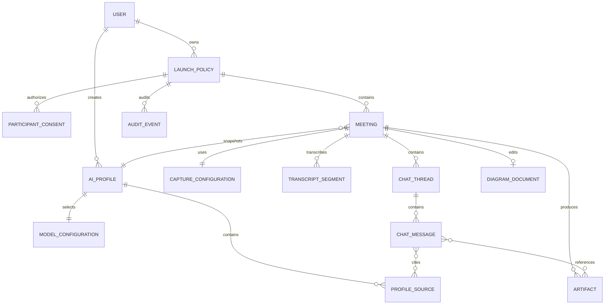

# Data Model: Interview Copilot

## Conventions

- IDs are UUIDv7 strings generated in Rust; mock fixtures may use stable readable IDs.
- Timestamps are UTC ISO-8601 in contracts and integer milliseconds in SQLite.
- User-provided filenames and paths are never persisted as filesystem paths. Rust maps an opaque `storageKey` to the controlled app-data root.
- Mutable records include `createdAt`, `updatedAt` and an integer `revision` for stale-write detection.
- Every meeting-owned row carries `meetingId`; every privileged action also carries `launchPolicyId` and `userId`.
- `deletedAt` is used only for the short deletion workflow. Retention cleanup physically removes content and leaves the minimal audit event required by policy.
- The mock backend returns DTOs, not raw database rows. Secret hashes, internal storage keys and audit-chain fields never cross into the overlay window.

## Relationship overview



## Security and authorization records

### User

Represents the mocked configured identity shown by the Better Auth client.

| Field | Type | Rules |
|---|---|---|
| `id` | UUID | Immutable |
| `email` | string | Lowercased; must match the synthetic fixture allowlist in mock mode |
| `displayName` | string | 1–120 characters |
| `roles` | enum[] | `user`, `adversarial_user`, `security_admin`, `exporter` |
| `deviceIds` | string[] | Managed device identifiers allowed by current policy fixture |
| `status` | enum | `active`, `suspended`, `expired` |
| `lastAuthenticatedAt` | timestamp | Mock session evidence only |

**Invariant**: UI role checks are explanatory. Rust re-evaluates the active policy before every privileged command.

### SafetyPolicySnapshot

A short-lived local representation of the mocked control-plane response.

| Field | Type | Rules |
|---|---|---|
| `policyVersion` | string | Monotonic fixture version |
| `userId` | UUID | Must match session |
| `deviceId` | string | Must match managed device fixture |
| `environmentId` | string | Must be an approved test environment |
| `allowedLaunchPolicyIds` | UUID[] | Empty means no meeting may start |
| `allowAdversarial` | boolean | Requires adversarial role as well |
| `allowExport` | boolean | Requires exporter/security-admin role |
| `killSwitch` | enum | `clear`, `stop_new`, `stop_all` |
| `issuedAt` | timestamp | Informational in mock mode |
| `expiresAt` | timestamp | Expired or missing policy fails closed |
| `verification` | enum | `mock_valid`, `mock_invalid`, `unavailable` |

**Invariant**: `verification != mock_valid`, a stale snapshot, or `killSwitch != clear` blocks meeting start. `stop_all` also transitions any active meeting to stopping.

### Launch Policy

| Field | Type | Rules |
|---|---|---|
| `id` | UUID | Internal only; never shown in normal navigation or meeting readiness |
| `title` | string | 1–160 characters |
| `purpose` | string | Required, 20–2,000 characters |
| `ownerUserId` | UUID | Active user |
| `status` | enum | `draft`, `approved`, `active`, `stopped`, `expired` |
| `environmentId` | string | Must match policy snapshot |
| `approvedDeviceIds` | string[] | At least current device at meeting start |
| `adversarialApproved` | boolean | Separate explicit approval |
| `retentionDays` | integer | `1..30` |
| `startsAt` | timestamp | Required for approval |
| `expiresAt` | timestamp | After `startsAt`; cannot be extended by user |
| `approvedBy` | UUID? | Security-admin fixture |
| `approvedAt` | timestamp? | Required when approved |

### ParticipantConsent

| Field | Type | Rules |
|---|---|---|
| `id` | UUID | Immutable |
| `launchPolicyId` | UUID | Parent launch policy |
| `participantLabel` | string | Synthetic identifier or approved participant label; no unnecessary PII |
| `consentArtifactId` | UUID | References a vetted artifact |
| `scope` | enum[] | `audio`, `screen`, `transcript`, `model_processing` |
| `signedAt` | timestamp | Required |
| `revokedAt` | timestamp? | Revocation blocks new meetings immediately |

**Launch Policy start invariant**: approved and unexpired launch policy, active owner, current device/environment allowlisted, all participants have unrevoked consent covering enabled capture, fresh clear policy and separate adversarial approval/role when requested.

## Profile and model records

### AIProfile

| Field | Type | Rules |
|---|---|---|
| `id` | UUID | Immutable |
| `ownerUserId` | UUID | Required |
| `name` | string | 1–100 characters, unique per owner |
| `status` | enum | `draft`, `ready`, `archived` |
| `manualContext` | string | Up to approved local limit; synthetic/approved data only |
| `modelConfigurationId` | UUID | Required before ready |
| `createdAt`, `updatedAt` | timestamp | Audit updates |

**Invariant**: A profile becomes `ready` only after all sources are `allowed` or `redacted`, the vacancy extraction is reviewed, and a supported model configuration is selected.

### VacancySource

| Field | Type | Rules |
|---|---|---|
| `id` | UUID | One active vacancy per profile in v1 |
| `profileId` | UUID | Parent profile |
| `sourceKind` | enum | `url`, `pasted_text` |
| `sourceValue` | string | URL or text; URL fetched only by mock handler from approved fixture hosts |
| `roleTitle` | string | Editable extracted result |
| `companyContext` | string | Editable, synthetic only |
| `responsibilities` | string[] | Editable |
| `requirements` | string[] | Editable |
| `reviewStatus` | enum | `pending`, `needs_review`, `confirmed`, `rejected` |
| `provenance` | object | Fixture ID, extraction model ID, extractedAt |

### ProfileSource

Unifies resume, manual profile and project materials for provenance.

| Field | Type | Rules |
|---|---|---|
| `id` | UUID | Stable citation ID |
| `profileId` | UUID | Parent profile |
| `kind` | enum | `resume`, `manual`, `project` |
| `displayName` | string | Safe label, not a path |
| `mimeType` | string? | Allowlisted for uploaded fixtures |
| `storageKey` | string? | Rust-only opaque key |
| `extractedFacts` | object[] | `{ id, category, text, sourceRange }` |
| `contentStatus` | enum | `pending`, `allowed`, `redacted`, `rejected` |
| `redactionSummary` | string? | Human-readable decision |
| `checksum` | string? | SHA-256 of stored approved content |

### ModelConfiguration

| Field | Type | Rules |
|---|---|---|
| `id` | UUID | Immutable configuration record |
| `responseModelId` | string | Must exist in mock model catalog |
| `transcriptionModelId` | string | Initial fixtures: `whisper-large-v3-turbo`, `parakeet` |
| `translationLanguage` | string | BCP-47 tag or `none` |
| `answerDepth` | enum | `brief`, `balanced`, `detailed` |
| `questionConfidenceThreshold` | number | `0..1`; default fixture value is explicit |
| `processingBoundaryId` | string | Must match approved mock boundary |

**Snapshot rule**: A meeting copies this configuration at start so later profile edits cannot alter historical evidence.

### ModelCatalogEntry

| Field | Type | Rules |
|---|---|---|
| `id` | string | Exact stable model ID; initial ASR IDs are `openai/whisper-large-v3-turbo` and `nvidia/parakeet-tdt-0.6b-v3` |
| `kind` | enum | `response`, `transcription`, `translation` |
| `displayName` | string | Human-readable, never used as identity |
| `revision` | string | Exact approved revision or `mock-fixture` |
| `license` | string | Whisper: `MIT`; Parakeet v3: `CC-BY-4.0` |
| `supportedLanguages` | string[] | BCP-47 tags from the pinned model card/fixture |
| `runtime` | string | `mock`, or an approved future hosting/runtime description |
| `processingBoundaryId` | string | Required before `availability=available` |
| `availability` | enum | `mock`, `available`, `unavailable`, `disabled` |
| `benchmarkStatus` | enum | `not_applicable_mock`, `pending`, `passed`, `failed` |
| `latencyP95Ms` | integer? | Populated only by an approved-hardware benchmark |
| `sourceUrl` | string | Approved upstream model card |

**Invariant**: selection does not imply availability. Meeting start snapshots the chosen entries; if an entry becomes unavailable, the app reports the error and never substitutes another ID.

### PresentationProfile

Controls approved validation identity and system-surface behavior.

| Field | Type | Rules |
|---|---|---|
| `id` | string | Security-owned fixture ID |
| `mode` | enum | `standard`, `adversarial` |
| `displayName` | string | Internal approved name only |
| `iconAssetId` | string | Human-designed internal asset; no third-party artwork |
| `activationPolicy` | enum | `regular`, `accessory` |
| `showDockIcon` | boolean | Matrix-tested |
| `showNotifications` | boolean | Default false during adversarial meeting |
| `approvedMatrixRowIds` | string[] | Empty adversarial profile cannot activate |
| `separateSignedBundleRequired` | boolean | True when a different bundle display name is required |

**Invariant**: applying an adversarial presentation profile requires the same role, launch policy, device/environment and matrix gate as capture protection; the change and restoration are audited.

## Meeting records

### Meeting

| Field | Type | Rules |
|---|---|---|
| `id` | UUID | Immutable |
| `launchPolicyId` | UUID | Required and authorized |
| `profileId` | UUID | Active profile |
| `profileRevision` | integer | Snapshot provenance |
| `modelSnapshot` | object | Immutable meeting copy |
| `title` | string | 1–160 characters |
| `status` | enum | `prepared`, `gating`, `running`, `stopping`, `completed`, `failed`, `expired` |
| `mode` | enum | `standard_lab`, `adversarial_lab` |
| `captureConfigurationId` | UUID | Required before start |
| `contextGeneration` | integer | Incremented by context reset |
| `startedAt`, `endedAt` | timestamp? | State-derived |
| `retentionExpiresAt` | timestamp | `endedAt + launchPolicy.retentionDays` |
| `failureCode` | string? | Stable error code |

**State transitions**:

```text
prepared → gating → running → stopping → completed → expired
             └────→ failed      └──────→ failed
```

- Only Rust may enter `running`, after a fresh gate check.
- `stop_all`, lost policy freshness or revoked consent sends `running → stopping`.
- A failed finalization preserves audit and any already-completed vetted artifacts but blocks further model operations.

### PermissionSnapshot

Derived live from macOS and emitted to Vue; not treated as persisted authority.

| Field | Type | Rules |
|---|---|---|
| `screenRecording` | enum | `not_determined`, `granted`, `denied`, `restricted` |
| `microphone` | enum | Same |
| `accessibility` | enum | Same; `not_required` allowed if no AX-dependent behavior is enabled |
| `observedAt` | timestamp | Fresh observation time |
| `restartMayBeRequired` | boolean | Explains TCC behavior |

### CaptureConfiguration

| Field | Type | Rules |
|---|---|---|
| `id` | UUID | Meeting-owned |
| `displayId` | integer | ScreenCaptureKit display identifier, not display name |
| `area` | object? | `{ x, y, width, height }` in logical points |
| `backingScale` | number | Captured when area is confirmed |
| `captureSystemAudio` | boolean | Required for interviewer audio in usual conferencing flows |
| `captureMicrophone` | boolean | User audio |
| `showsCursorInOwnArtifacts` | boolean | Default false |
| `autoScreenshotMode` | enum | `off`, `display`, `area` |
| `soundThreshold` | number | Normalized VAD threshold |
| `matrixRowId` | string? | Required for adversarial mode |

### Artifact

| Field | Type | Rules |
|---|---|---|
| `id` | UUID | Opaque reference |
| `meetingId` | UUID | Required |
| `kind` | enum | `audio_chunk`, `recording`, `screenshot`, `consent`, `profile_file`, `export_bundle` |
| `storageKey` | string | Rust-only |
| `mimeType` | string | Allowlisted |
| `byteLength` | integer | Non-negative and bounded by kind |
| `checksum` | string | SHA-256 |
| `contentStatus` | enum | `pending`, `allowed`, `redacted`, `rejected`, `expired`, `deleted` |
| `redactedFromArtifactId` | UUID? | Preserves lineage |
| `createdAt`, `expiresAt` | timestamp | Policy-derived |

**State transitions**:

```text
pending → allowed ─────────────→ expired → deleted
       ├→ redacted ────────────→ expired → deleted
       └→ rejected ────────────→ deleted
```

Only `allowed` or `redacted` artifacts may be attached to a message or indexed.

### TranscriptSegment

| Field | Type | Rules |
|---|---|---|
| `id` | UUID | Immutable after final |
| `meetingId` | UUID | Required |
| `sequence` | integer | Strictly increasing per meeting |
| `speaker` | enum | `interviewer`, `user`, `unknown` |
| `text` | string | Escaped in UI |
| `confidence` | number | `0..1` |
| `isFinal` | boolean | Partial rows are replaced, not indexed |
| `isQuestion` | boolean | Valid only for final segment |
| `startedAtMs`, `endedAtMs` | integer | Relative to meeting start |

### ChatThread and ChatMessage

`ChatThread` has `id`, `meetingId`, `kind: live | side`, `createdAt`. Exactly one of each kind exists per meeting.

| ChatMessage field | Type | Rules |
|---|---|---|
| `id` | UUID | Client-generated for idempotence |
| `threadId` | UUID | Live/side isolation boundary |
| `sequence` | integer | Server/mock assigned monotonic order |
| `role` | enum | `user`, `assistant`, `system` |
| `content` | string | Markdown subset; HTML disabled |
| `status` | enum | `pending`, `streaming`, `complete`, `error`, `cancelled` |
| `replyToSegmentId` | UUID? | Recognized question provenance |
| `artifactIds` | UUID[] | Vetted visual context only |
| `profileSourceIds` | UUID[] | Sources used in answer |
| `contextGeneration` | integer | Prevents pre-reset context from leaking forward |
| `confidence` | number? | For automatic question/answer flow |

**Invariant**: Reset increments `Meeting.contextGeneration`; it does not delete messages. New requests include only the current generation plus the immutable active profile snapshot.

### DiagramDocument

| Field | Type | Rules |
|---|---|---|
| `id` | UUID | At most one per meeting in v1 |
| `meetingId` | UUID | Required |
| `revision` | integer | Incremented atomically |
| `nodes` | object[] | `{ id, label, kind, x, y, width, height }` |
| `edges` | object[] | `{ id, from, to, label? }` |
| `pendingProposal` | object? | Ordered validated graph operations |

Allowed operations are `add_node`, `move_node`, `rename_node`, `remove_node`, `add_edge`, `remove_edge`. Applying a proposal requires matching the current revision; every accepted operation has an inverse for undo.

## Preferences, entitlement and audit

### AppPreferences

| Field | Type | Rules |
|---|---|---|
| `userId` | UUID | Primary key |
| `theme` | enum | `light`, `dark`, `auto` |
| `overlayPositionByDisplay` | object | Clamped logical coordinates |
| `selectedDisplayId` | integer? | Revalidated on every display change |
| `hotkeys` | object | Action-to-accelerator mapping; conflicts stored as errors, not active bindings |
| `reduceVisualEffectsOverride` | enum | `system`, `reduce` |

### MockEntitlement

| Field | Type | Rules |
|---|---|---|
| `userId` | UUID | One active fixture entitlement |
| `plan` | string | `demo` |
| `status` | enum | `inactive`, `active`, `expired` |
| `source` | literal | Always `mock_button` |
| `grantedAt`, `expiresAt` | timestamp? | No payment identifiers or processor fields |

### AuditEvent

| Field | Type | Rules |
|---|---|---|
| `sequence` | integer | Global monotonic primary key |
| `id` | UUID | Immutable |
| `occurredAt` | timestamp | Rust clock |
| `userId` | UUID? | Null only for startup/system events |
| `launchPolicyId` | UUID? | Required for launch policy actions |
| `meetingId` | UUID? | Required for meeting actions |
| `action` | string enum | Login, gate, capture, stealth, export, delete, allowlist/policy, kill switch, retention |
| `outcome` | enum | `allowed`, `denied`, `succeeded`, `failed`, `stopped` |
| `reasonCode` | string | Stable machine-readable code |
| `metadata` | object | Allowlisted keys only; no transcript or raw PII |
| `previousHash` | string | Prior row hash or genesis value |
| `eventHash` | string | Hash of canonical event plus `previousHash` |
| `retentionExpiresAt` | timestamp | 365 days from event |

**Invariant**: No update/delete command exists for unexpired audit rows. Chain verification runs at startup and before export; failure disables privileged actions and emits a local critical status.

## Indexes and query rules

- Unique: `user.email`, `(profile.ownerUserId, profile.name)`, `(meetingId, chatThread.kind)`, `(meetingId, transcript.sequence)`.
- Lookup: launch policy status/expiry, meeting launch policy/profile/status/date, artifact meeting/status/expiry, audit launch policy/time/action.
- FTS5: meeting title, confirmed vacancy fields, final transcript text and complete chat text. Rejected/pending artifacts, partial transcripts and manual security metadata are excluded.
- Search results always filter by the active user's authorized launch policy set before pagination.
- Pagination uses stable `(createdAt, id)` cursors; no offset scan for the 10,000-meeting target.

## Retention and deletion transaction

1. Mark meeting `expired` and block reads/model operations.
2. Remove FTS rows.
3. Delete recording/screenshot/profile-derived meeting files under the controlled root.
4. Delete transcript and chat content, diagram state and artifact rows.
5. Retain only identifiers and the minimal `content_retention_deleted` audit event for 365 days.
6. Verify no remaining storage key or search row references the meeting.

Failure at any step is retried idempotently and visible to the security-admin mock screen; expired content remains inaccessible even while physical cleanup retries.
